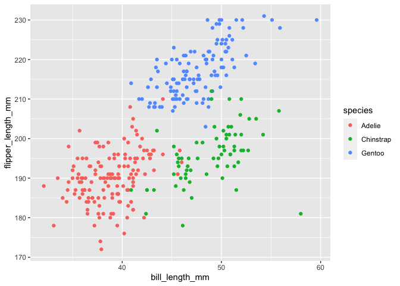

p8105_hw1_yl5220
================
2022-09-24

# Problem 1

**Import dataset**

``` r
library(tidyverse)
```

    ## ── Attaching packages ─────────────────────────────────────── tidyverse 1.3.2 ──
    ## ✔ ggplot2 3.3.6      ✔ purrr   0.3.4 
    ## ✔ tibble  3.1.8      ✔ dplyr   1.0.10
    ## ✔ tidyr   1.2.1      ✔ stringr 1.4.1 
    ## ✔ readr   2.1.2      ✔ forcats 0.5.2 
    ## ── Conflicts ────────────────────────────────────────── tidyverse_conflicts() ──
    ## ✖ dplyr::filter() masks stats::filter()
    ## ✖ dplyr::lag()    masks stats::lag()

``` r
data("penguins", package = "palmerpenguins")
```

**Clean NA values from the dataset**

``` r
penguins = drop_na(penguins)
```

**Description of dataset** The names and values of important variables
are species, island, bill_length_mm, bill_depth_mm, flipper_length_mm,
body_mass_g, sex, year The size of the dataset is: 333 rows and 8
columns The mean flipper length is: 200.966967 mm

**Make scatterplot**

``` r
ggplot(penguins, aes(x=bill_length_mm, y=flipper_length_mm, color = species)) + geom_point()
```

<!-- -->

``` r
ggsave("penguins.pdf")
```

    ## Saving 7 x 5 in image

# Problem 2

**Create dataframe**

``` r
example_df = tibble(
  sample = rnorm(10),
  vec_logical = sample > 0,
  vec_char = c("My", "name", "is", "Yixuan", "Hi", "again", "this", "is", "Yichen", "bye"),
  vec_factor = factor(c("male", "male", "male", "female", "female", "female", "other", "other", "other", "other"))
)
```

**Take the mean of each variable**

``` r
mean(example_df$sample)
```

    ## [1] 0.3108111

``` r
mean(example_df$vec_logical)
```

    ## [1] 0.5

``` r
mean(example_df$vec_char)
```

    ## Warning in mean.default(example_df$vec_char): argument is not numeric or
    ## logical: returning NA

    ## [1] NA

``` r
mean(example_df$vec_factor)
```

    ## Warning in mean.default(example_df$vec_factor): argument is not numeric or
    ## logical: returning NA

    ## [1] NA

Mean works for the numeric and logistic type, but not for the character
and factor types.

**Apply as.numeric function**

``` r
as.numeric(example_df$sample)
```

    ##  [1] -0.253458322  0.450772650  1.125191254 -0.950453491 -0.081231759
    ##  [6]  2.279708689  0.007378234 -0.081366244 -0.438489769  1.050059699

``` r
as.numeric(example_df$vec_logical)
```

    ##  [1] 0 1 1 0 0 1 1 0 0 1

``` r
as.numeric(example_df$vec_char)
```

    ## Warning: NAs introduced by coercion

    ##  [1] NA NA NA NA NA NA NA NA NA NA

``` r
as.numeric(example_df$vec_factor)
```

    ##  [1] 2 2 2 1 1 1 3 3 3 3

The function turned logical type into values 0 and 1, factor type into
number series, and character type into NA. This helps explain why the
mean of logistic type can be taken.
